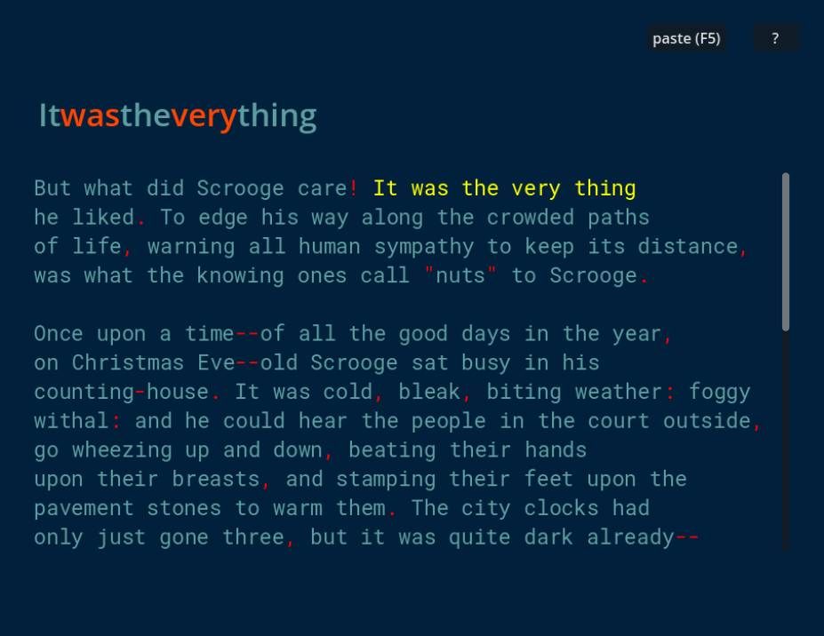

# reader

This is program to assist or improve reading
experience by reducing eye movement. This
is done by showing chunks of words one
at a time, with a large text size.

This is very much a work-in-progress project.
Currently, the program works by reading the
the text copied (with ctrl-c or right-click + copy).
In the future, I'm planning on making
it a proper PDF and epub reader. But for now,
copy/pasting works for my use case.

I'm still testing it to find
the optimal reading experience. So far,
I've managed to read about 200 pages with it. I'm
pretty comfortable with the current config,
although it might be too particular for
my preference and reading style.

The primary goal is reading comfort
for long or large blocks of text. Secondary
(and optional) goal is to improve reading speed.

# Download and setup

1. Install godot (dotnet version)
2. Download project
3. Open project with godot
4. Run with _F5_

